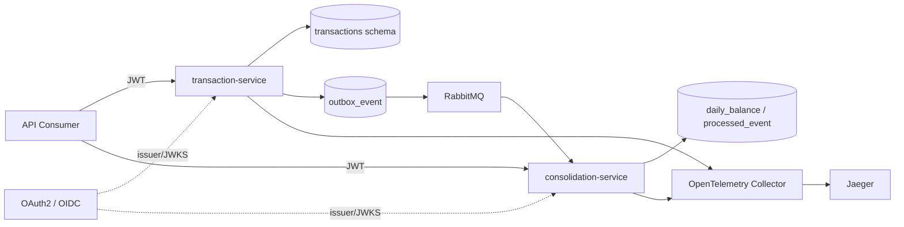
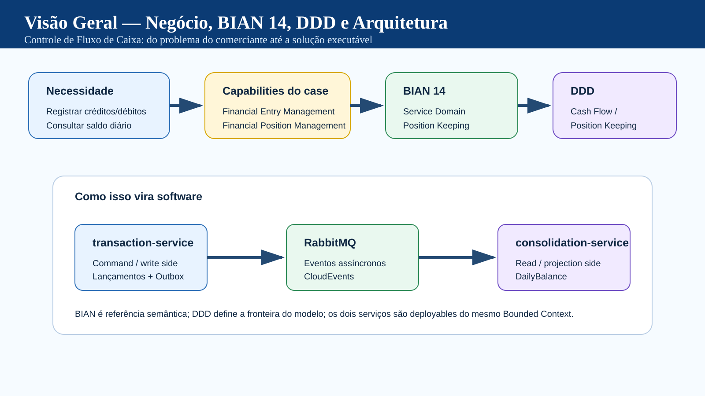
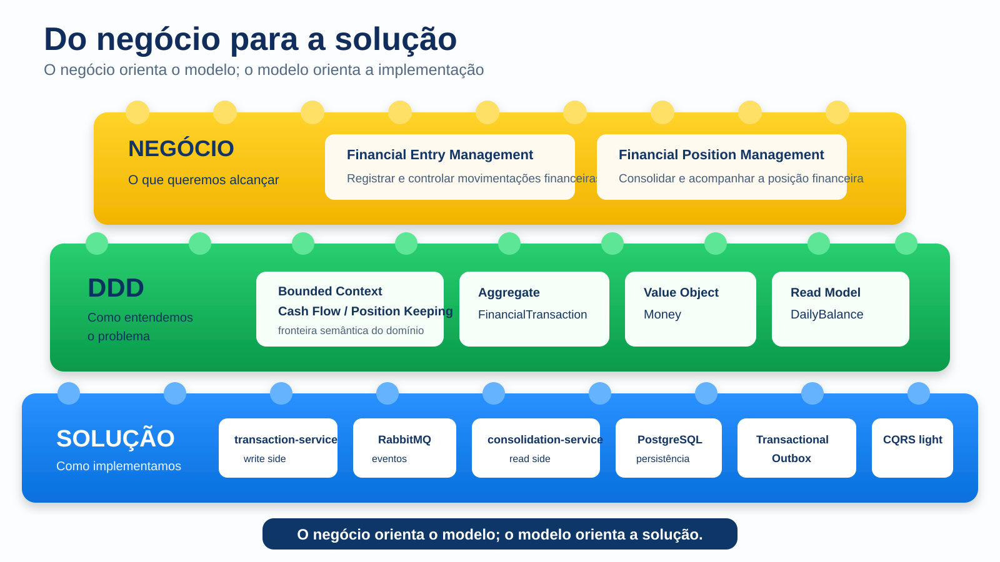
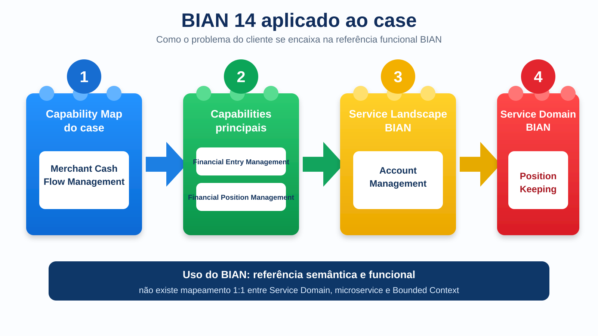
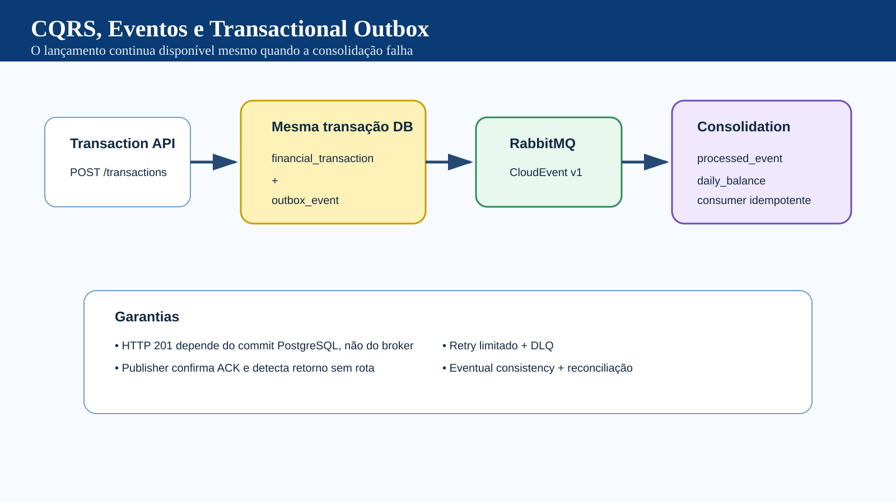
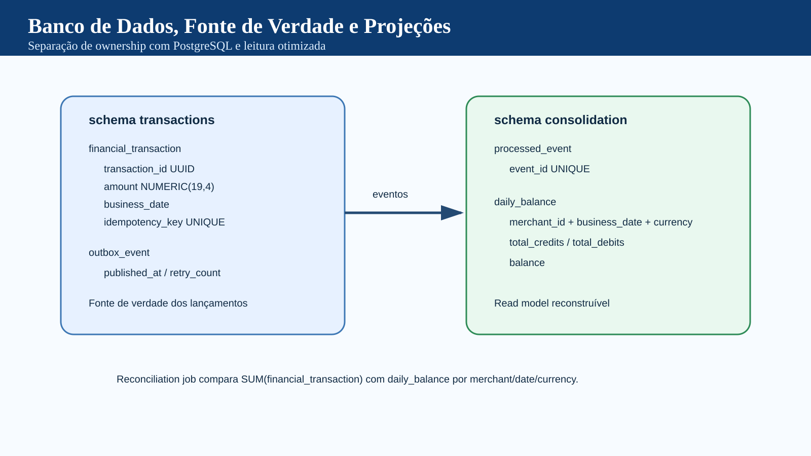
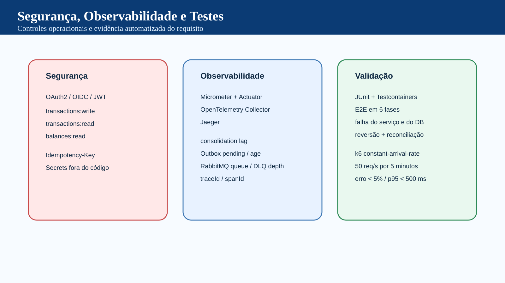

# verx-case-ext — Cash Flow / Position Keeping

Implementação executável do case de arquitetura para **registro de lançamentos de crédito/débito** e **consulta de saldo diário consolidado**, com foco em disponibilidade, resiliência, consistência, observabilidade e validação de performance.

> Este repositório contém somente a aplicação, testes, automações de CI/CD e recursos necessários para execução local. A documentação arquitetural relevante está consolidada neste README.

---

## 1. Objetivo

A solução atende dois fluxos principais:

1. **Financial Entry Management** — registrar lançamentos financeiros de crédito e débito.
2. **Financial Position Management** — consultar a posição diária consolidada por comerciante, data de negócio e moeda.

O requisito de resiliência é tratado explicitamente: **a indisponibilidade do serviço de consolidação não deve impedir novos lançamentos**.

O requisito de carga do consolidado é validado com **50 requisições por segundo**, usando k6 com `constant-arrival-rate`.

---

## 2. Referência de negócio — BIAN 14.0

A referência funcional utilizada é o **BIAN Service Landscape 14.0**, principalmente o Service Domain **Position Keeping**.

No contexto deste case, a relação é:

```text
Problema do cliente
    ↓
Merchant Cash Flow Management
    ├── Financial Entry Management
    └── Financial Position Management
    ↓
BIAN Position Keeping
```

`Position Keeping` é aderente ao problema porque cobre a manutenção de lançamentos financeiros de débito/crédito e da posição/saldo correspondente.

O BIAN é usado como **referência semântica e funcional**. A solução não se declara “BIAN compliant” e não transforma automaticamente um BIAN Service Domain em microservice ou Bounded Context.

Referência oficial:

- https://bian.org/deliverables/service-landscape/
- https://bian.org/servicelandscape-14-0-0/object_14.html?object=34193

---

## 3. DDD

### Bounded Context

A solução utiliza um único Bounded Context candidato:

```text
Cash Flow / Position Keeping
```

Dentro desse contexto existem dois deployables independentes:

```text
Cash Flow / Position Keeping
    ├── transaction-service
    └── consolidation-service
```

A separação física ocorre por necessidades diferentes de disponibilidade, processamento e escala; ela não implica dois Bounded Contexts.

### DDD tático

No write side:

- **Aggregate Root:** `FinancialTransaction`
- **Value Object:** `Money`
- **Domain enum:** `TransactionType`
- **Domain Event:** `FinancialTransactionRecorded`

O lançamento é imutável. Correções são feitas por **lançamento compensatório**, nunca por UPDATE/DELETE do lançamento original.

No read side:

- `DailyBalance` é uma **projeção CQRS**, não a fonte de verdade.

---

## 4. Arquitetura



### Fluxo de escrita

```text
POST /v1/transactions
    ↓
validação de domínio
    ↓
BEGIN
  INSERT financial_transaction
  INSERT outbox_event
COMMIT
    ↓
HTTP 201
```

O RabbitMQ não participa do commit HTTP.

### Fluxo assíncrono

```text
outbox_event
    ↓
Outbox Publisher
    ↓
RabbitMQ
    ↓
FinancialTransactionRecorded.v1
    ↓
consolidation-service
    ↓
processed_event + daily_balance
```

---

## 5. Guia visual da arquitetura

As figuras abaixo resumem as decisões principais do case. Elas são complementares ao texto e representam somente o estado final da solução entregue.

### 5.1 Do negócio ao sistema — BIAN 14, DDD e solução



### 5.2 DDD estratégico e tático



### 5.3 Arquitetura Hexagonal e microserviços



### 5.4 CQRS, eventos e Transactional Outbox



### 5.5 Persistência e projeções



### 5.6 Segurança, observabilidade e testes



---

## 7. Padrões aplicados

### Hexagonal / Ports & Adapters

Os serviços separam:

```text
Adapters In
    ↓
Application
    ↓
Ports
    ↑
Adapters Out
```

A camada de aplicação não depende diretamente do adapter JDBC.

### CQRS leve

```text
Write model
FinancialTransaction
      ↓ evento
Read model
DailyBalance
```

Não foi adotado Event Sourcing porque não é necessário para os requisitos do case.

### Event-Driven Architecture

A consolidação é desacoplada do lançamento por mensageria assíncrona.

### Transactional Outbox

`financial_transaction` e `outbox_event` são persistidos na mesma transação.

Isso evita o dual-write:

```text
DB commit ✅
broker publish ❌
```

O evento só é marcado como publicado após confirmação do broker e ausência de retorno por rota inválida.

### Idempotência

Dois níveis:

- API: `Idempotency-Key`
- consumer: `processed_event.event_id` único

### Consistência eventual

O lançamento é confirmado imediatamente após o commit.

O consolidado converge de forma assíncrona.

---

## 7. Resiliência

Se o serviço de consolidação ficar indisponível:

```text
consolidation-service DOWN
        ↓
transaction-service continua aceitando lançamentos
        ↓
transaction + outbox persistidos
        ↓
RabbitMQ mantém backlog
        ↓
consolidation-service retorna
        ↓
backlog é consumido
        ↓
daily_balance converge
```

Também existe validação automatizada para indisponibilidade temporária do PostgreSQL utilizado pelo `consolidation-service`.

O consumer utiliza retry limitado com backoff antes de DLQ.

---

## 8. Reversão / estorno

Um lançamento confirmado nunca é alterado.

A reversão gera um novo lançamento compensatório:

```text
Original
CREDIT 40.0000

Reversal
DEBIT 40.0000
reversalOfTransactionId = <original>

Saldo líquido = 0
```

Endpoint:

```http
POST /v1/transactions/{transactionId}/reversals
```

A operação também utiliza `Idempotency-Key`.

---

## 9. Persistência

PostgreSQL 16 com um banco `cashflow` e dois schemas lógicos:

```text
cashflow
├── transactions
│   ├── financial_transaction
│   └── outbox_event
│
└── consolidation
    ├── daily_balance
    └── processed_event
```

Cada serviço usa usuário e ownership próprios.

Precisão monetária:

```text
NUMERIC(19,4)
```

O `businessDate` é derivado de `occurredAt` usando:

```text
America/Sao_Paulo
```

---

## 10. Segurança

As APIs utilizam OAuth2 Resource Server / JWT.

Scopes:

```text
transactions:write
transactions:read
balances:read
```

No ambiente local existe um IdP mock apenas para permitir execução reproduzível.

---

## 11. Observabilidade

Implementado:

- Spring Boot Actuator
- Micrometer
- Prometheus endpoint
- OpenTelemetry
- OpenTelemetry Collector
- Jaeger
- logs com `traceId` e `spanId`

Métricas de negócio/operação incluem:

```text
cashflow_transactions_created_total
cashflow_outbox_published_total
cashflow_outbox_publish_errors_total
cashflow_outbox_pending
cashflow_outbox_oldest_age_seconds

cashflow_consolidation_events_processed_total
cashflow_consolidation_events_duplicates_total
cashflow_consolidation_events_errors_total
cashflow_consolidation_lag_seconds

cashflow_rabbitmq_queue_depth
```

---

## 12. Reconciliação

O write model é a fonte de verdade.

O script:

```bash
sh scripts/reconcile-balances.sh
```

recalcula, a partir de `transactions.financial_transaction`:

```text
totalCredits
totalDebits
balance
```

e compara com `consolidation.daily_balance`.

Qualquer divergência retorna erro.

---

## 13. Stack

| Componente | Tecnologia |
|---|---|
| Runtime | Java 21 |
| Framework | Spring Boot 3 |
| Banco | PostgreSQL 16 |
| Broker | RabbitMQ 4 |
| Auth | OAuth2/OIDC + JWT |
| Arquitetura interna | Hexagonal / Ports & Adapters |
| Integração | Event-Driven |
| Consistência | Transactional Outbox + eventual consistency |
| Observabilidade | Micrometer + OpenTelemetry + Jaeger |
| Performance | k6 |
| Testes | JUnit + Mockito + Testcontainers |
| CI | GitHub Actions |

---

## 14. Pré-requisitos

Para executar localmente:

- Docker + Docker Compose
- `openssl`
- `curl`
- Python 3 para os scripts de validação

Java/Maven não são necessários para subir a aplicação via Docker; são necessários apenas para desenvolvimento local fora dos containers.

---

## 15. Subir a aplicação

### 1. Criar credenciais locais

```bash
sh scripts/setup-local-env.sh
```

Esse comando cria um arquivo `.env` local e ignorado pelo Git.

### 2. Subir a stack

```bash
docker compose up -d --build
```

### 3. Validar health

```bash
sh scripts/verify-local.sh
```

### 4. Obter token OAuth

```bash
TOKEN=$(sh scripts/get-local-token.sh \
  | python3 -c 'import json,sys; print(json.load(sys.stdin)["access_token"])')

export TOKEN
```

---

## 16. Executar validação funcional

Fluxo principal:

```bash
sh scripts/verify-e2e.sh
```

O cenário cria crédito e débito e aguarda a projeção até validar o saldo consolidado.

### Resiliência — serviço de consolidação indisponível

```bash
sh scripts/verify-consolidation-resilience.sh
```

### Resiliência — banco do consolidado indisponível

```bash
sh scripts/verify-consolidation-db-resilience.sh
```

### Reversão imutável

```bash
sh scripts/verify-reversal.sh
```

### Reconciliação

```bash
sh scripts/reconcile-balances.sh
```

---

## 17. Performance — requisito de 50 req/s

O teste usa k6 com `constant-arrival-rate`, evitando confundir número de usuários virtuais com taxa real de requisições.

Baseline:

```bash
sh scripts/run-performance-tests.sh baseline
```

Critérios:

```text
50 req/s
5 minutos
http_req_failed < 5%
checks > 95%
dropped_iterations = 0
p95 < 500 ms
```

Perfis adicionais:

```bash
sh scripts/run-performance-tests.sh peak
sh scripts/run-performance-tests.sh stress
```

O gate contratual continua sendo o baseline de 50 req/s.

---

## 18. Pipelines

Três workflows principais:

### Build and tests

```text
mvn clean verify
```

Executa testes unitários e de integração com Java 21.

### E2E phased validation

Valida:

```text
1. ambiente / health / OAuth
2. crédito + débito + saldo
3. outage do consolidation-service
4. outage do banco do consolidation-service
5. reversão imutável
6. reconciliação transaction store x read model
```

### Performance validation

Executa automaticamente o baseline de 50 req/s e publica a evidência do k6 como artifact do GitHub Actions.

---

## 19. Endpoints principais

```http
POST /v1/transactions
GET  /v1/transactions/{transactionId}
GET  /v1/transactions?merchantId=...
POST /v1/transactions/{transactionId}/reversals

GET  /v1/merchants/{merchantId}/daily-balances/{date}?currency=BRL
```

---

## 20. Interfaces locais

Após `docker compose up`:

| Interface | URL |
|---|---|
| transaction-service | http://localhost:8081 |
| consolidation-service | http://localhost:8082 |
| pgAdmin | http://localhost:5050 |
| RabbitMQ Management | http://localhost:15672 |
| Jaeger | http://localhost:16686 |

---

## 21. Arquitetura alvo

A aplicação foi mantida independente do provedor de cloud.

A topologia de produção prevista é Kubernetes gerenciado:

```text
Azure
AKS
 + Azure Database for PostgreSQL
 + RabbitMQ gerenciado

ou

GCP
GKE
 + Cloud SQL for PostgreSQL
 + RabbitMQ gerenciado
```

Azure Service Bus e Google Pub/Sub não são tratados como substitutos transparentes de RabbitMQ, pois exigiriam mudança no adapter/contrato de mensageria.

---

## 22. Encerrar o ambiente

```bash
docker compose down -v
```

---

## Resumo

A solução prioriza a relação direta entre requisito e decisão arquitetural:

```text
lançamento precisa sobreviver à falha da consolidação
        ↓
EDA + Transactional Outbox + RabbitMQ

consolidado precisa escalar leitura
        ↓
CQRS light + read model dedicado

entrega pode ser at-least-once
        ↓
consumer idempotente

domínio financeiro exige rastreabilidade
        ↓
lançamentos imutáveis + reversão compensatória + reconciliação
```

O objetivo é manter o desenho pequeno, executável e justificável, evitando complexidade sem requisito correspondente.
