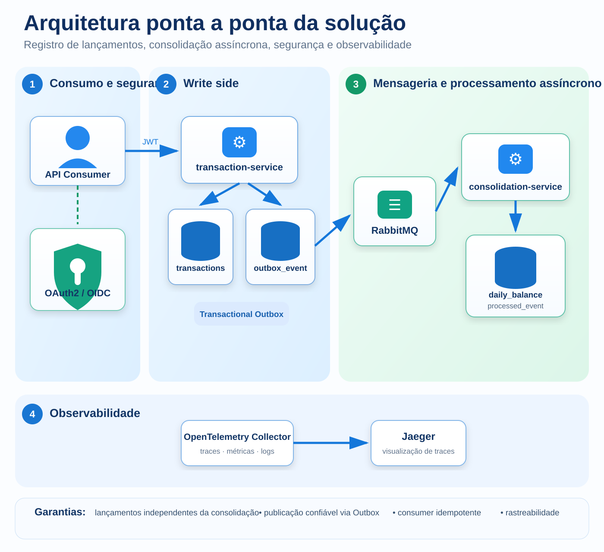

# verx-case-ext — Cash Flow / Position Keeping

Implementação executável do case de arquitetura para **registro de lançamentos de crédito/débito** e **consulta de saldo diário consolidado**.

A solução foi desenhada para demonstrar, de forma reproduzível, os principais requisitos do desafio:

- novos lançamentos continuam disponíveis mesmo se o consolidado estiver indisponível;
- consolidação desacoplada e assíncrona;
- idempotência no comando e no consumo de eventos;
- consistência eventual controlada;
- rastreabilidade e observabilidade;
- validação automatizada de **50 req/s** no serviço de consolidado.

> Este repositório público contém somente a aplicação, os testes, os workflows e a infraestrutura local necessária para execução. As decisões relevantes para avaliação estão consolidadas neste README.

---

## 1. Visão de negócio

O problema foi tratado primeiro como capacidade de negócio e depois traduzido para domínio e tecnologia.


As capabilities utilizadas no case são:

```text
Merchant Cash Flow Management
├── Financial Entry Management
├── Financial Position Management
└── Operational Resilience
```

Elas representam, respectivamente:

- registrar e controlar movimentações financeiras;
- consolidar e consultar a posição diária;
- manter o fluxo de lançamento disponível mesmo durante falhas do read side.

---

## 2. Referência BIAN 14.0

A referência funcional adotada é o **BIAN Service Landscape 14.0**, principalmente o Service Domain **Position Keeping**.


A relação utilizada é:

```text
Problema do cliente
        ↓
Capability Map do case
        ↓
Financial Entry Management
Financial Position Management
        ↓
BIAN Service Landscape
Account Management
        ↓
BIAN Service Domain
Position Keeping
```

`Position Keeping` é uma referência aderente porque trata da manutenção de lançamentos de débito/crédito e da posição financeira correspondente.

O BIAN é utilizado como **referência semântica e funcional**. A implementação não é apresentada como “BIAN compliant” e não assume equivalência automática entre:

```text
BIAN Service Domain
≠ Microservice
≠ DDD Bounded Context
```

Referências oficiais:

- https://bian.org/deliverables/service-landscape/
- https://bian.org/servicelandscape-14-0-0/object_14.html?object=34193

---

## 3. DDD: do negócio para o modelo

A solução utiliza um único Bounded Context candidato:

```text
Cash Flow / Position Keeping
```


### DDD estratégico

Os dois serviços pertencem ao mesmo contexto semântico:

```text
Cash Flow / Position Keeping
├── transaction-service
└── consolidation-service
```

A separação física existe por necessidades distintas de disponibilidade, processamento e escala. **Dois deployables não significam dois Bounded Contexts.**

### DDD tático

No write side:

| Elemento | Implementação |
|---|---|
| Aggregate Root | `FinancialTransaction` |
| Value Object | `Money` |
| Enum de domínio | `TransactionType` |
| Domain Event | `FinancialTransactionRecorded` |

No read side:

- `DailyBalance` é uma projeção CQRS;
- não é a fonte de verdade;
- pode ser reconstruída a partir dos lançamentos/eventos.

Lançamentos financeiros são imutáveis. Uma correção é representada por **novo lançamento compensatório**, nunca por UPDATE/DELETE do lançamento original.

---

## 4. Arquitetura da solução

O desenho abaixo substitui a representação simplificada anterior e mostra o fluxo completo da aplicação.



### Fluxo de escrita

```text
POST /v1/transactions
        ↓
validação de domínio
        ↓
BEGIN
  INSERT financial_transaction
  INSERT outbox_event
COMMIT
        ↓
HTTP 201
```

O broker **não participa do commit HTTP**.

A confirmação de uma transação depende da persistência atômica do lançamento e do registro no Outbox.

### Fluxo assíncrono

```text
outbox_event
        ↓
Outbox Publisher
        ↓
RabbitMQ
        ↓
FinancialTransactionRecorded.v1
        ↓
consolidation-service
        ↓
processed_event
        ↓
daily_balance
```

Se o serviço de consolidação estiver indisponível, o registro de novos lançamentos continua funcionando.

---

## 5. Padrões arquiteturais aplicados

### Hexagonal / Ports & Adapters

Cada serviço organiza as responsabilidades em:

```text
Adapters In
    ↓
Application
    ↓
Ports
    ↑
Adapters Out
```

REST, RabbitMQ e JDBC são detalhes de borda. A regra de domínio não é acoplada diretamente ao adapter de persistência.

### CQRS light

A solução separa comando e consulta sem introduzir Event Sourcing:

```text
Write model
FinancialTransaction
        ↓ evento
Read model
DailyBalance
```

### Event-Driven Architecture

A consolidação é executada de forma assíncrona para desacoplar disponibilidade e escala do write side e do read side.

### Transactional Outbox

`financial_transaction` e `outbox_event` são gravados na mesma transação PostgreSQL.

Isso elimina o dual-write clássico:

```text
DB commit ✅
broker publish ❌
```

O Outbox Publisher posteriormente publica no RabbitMQ. O evento somente é marcado como publicado após confirmação do broker e ausência de retorno por rota inválida.

### Idempotência

A aplicação possui proteção em dois pontos:

- API: `Idempotency-Key`;
- consumer: `processed_event.event_id` único.

### Consistência eventual

O lançamento é consistente após o commit.

O consolidado é uma projeção assíncrona e converge após o processamento do evento.

---

## 6. Stack

| Componente | Tecnologia |
|---|---|
| Runtime | Java 21 |
| Framework | Spring Boot 3 |
| Banco | PostgreSQL 16 |
| Broker | RabbitMQ 4.1 |
| Auth | OAuth2/OIDC + JWT |
| Arquitetura interna | Hexagonal / Ports & Adapters |
| Integração | Event-Driven Architecture |
| Consistência | Transactional Outbox + eventual consistency |
| Observabilidade | Micrometer + OpenTelemetry + Jaeger |
| Testes | JUnit + Mockito + Testcontainers |
| Performance | k6 |
| CI | GitHub Actions |

---

# Como executar

## 7. Pré-requisitos

Para a execução mais simples, utilizando Docker:

- Docker;
- Docker Compose;
- `openssl`;
- `curl`;
- Python 3.

> Java e Maven **não são necessários para subir a aplicação com Docker Compose**. Eles são necessários somente para desenvolvimento/build diretamente na máquina.

Para executar o benchmark local de performance, também é necessário instalar o **k6**.

---

## 8. Quick start

### 8.1 Clonar

```bash
git clone https://github.com/lucianofalls/verx-case-ext.git
cd verx-case-ext
```

### 8.2 Gerar credenciais locais

```bash
sh scripts/setup-local-env.sh
```

O script cria:

```text
.env
```

com senhas aleatórias para PostgreSQL e pgAdmin.

O arquivo é ignorado pelo Git.

### 8.3 Subir toda a stack

```bash
docker compose up -d --build
```

Esse comando inicia:

```text
postgres
pgadmin
rabbitmq
mock-idp
transaction-service
consolidation-service
otel-collector
jaeger
```

Na primeira execução, o Docker pode levar alguns minutos para baixar as imagens e compilar os serviços.

### 8.4 Verificar os containers

```bash
docker compose ps
```

### 8.5 Validar health e banco

```bash
sh scripts/verify-local.sh
```

Resultado esperado:

```text
Service on port 8081: UP
Service on port 8082: UP
```

Além dos health checks, o script valida a estrutura do PostgreSQL.

---

## 9. Obter token OAuth local

O ambiente possui um IdP mock somente para permitir uma validação reproduzível.

Execute:

```bash
TOKEN=$(sh scripts/get-local-token.sh \
  | python3 -c 'import json,sys; print(json.load(sys.stdin)["access_token"])')

export TOKEN
```

O token possui os scopes:

```text
transactions:write
transactions:read
balances:read
```

---

## 10. Validar o fluxo funcional completo

Com a stack em execução e `TOKEN` exportado:

```bash
sh scripts/verify-e2e.sh
```

O teste:

1. cria um `CREDIT 100.0000`;
2. cria um `DEBIT 25.0000`;
3. aguarda o consumo assíncrono;
4. consulta o consolidado;
5. valida:

```text
totalCredits = 100.0000
totalDebits  = 25.0000
balance      = 75.0000
```

Resultado esperado:

```text
[phase2] PASS
```

---

## 11. Chamadas manuais da API

### Criar lançamento

```bash
curl -X POST http://localhost:8081/v1/transactions \
  -H "Authorization: Bearer $TOKEN" \
  -H "Content-Type: application/json" \
  -H "Idempotency-Key: demo-credit-001" \
  -d '{
    "merchantId": "MERCHANT-001",
    "type": "CREDIT",
    "amount": "100.0000",
    "currency": "BRL",
    "description": "Demo transaction",
    "occurredAt": "2026-09-18T15:00:00Z"
  }'
```

### Consultar o saldo diário

```bash
curl \
  -H "Authorization: Bearer $TOKEN" \
  "http://localhost:8082/v1/merchants/MERCHANT-001/daily-balances/2026-09-18?currency=BRL"
```

Como a consolidação é assíncrona, pode existir um pequeno intervalo entre o HTTP 201 da transação e a atualização do read model.

---

## 12. Testes de resiliência

### Consolidation service indisponível

```bash
sh scripts/verify-consolidation-resilience.sh
```

Valida que:

```text
consolidation-service DOWN
        ↓
transaction-service continua aceitando lançamentos
        ↓
evento permanece disponível
        ↓
consolidation-service volta
        ↓
saldo converge
```

### PostgreSQL do read side indisponível

```bash
sh scripts/verify-consolidation-db-resilience.sh
```

O teste bloqueia temporariamente o usuário do banco do consolidado, força uma falha transitória e confirma recuperação/convergência após a restauração.

---

## 13. Reversão / estorno

O lançamento original é preservado.

A reversão cria um novo lançamento de tipo oposto:

```text
Original
CREDIT 40.0000

Reversal
DEBIT 40.0000
reversalOfTransactionId = <original>

Saldo líquido = 0
```

Validação automatizada:

```bash
sh scripts/verify-reversal.sh
```

Endpoint:

```http
POST /v1/transactions/{transactionId}/reversals
```

---

## 14. Reconciliação

O write model é a fonte de verdade.

Para comparar os lançamentos com a projeção:

```bash
sh scripts/reconcile-balances.sh
```

O job recalcula por:

```text
merchantId
businessDate
currency
```

e compara:

```text
SUM(CREDIT)
SUM(DEBIT)
CREDIT - DEBIT
```

com `daily_balance`.

Qualquer divergência faz o script falhar.

---

## 15. Performance — requisito de 50 req/s

O requisito é validado com k6 usando `constant-arrival-rate`.

Isso garante que o teste mede **taxa real de chegada**, em vez de usar quantidade de usuários virtuais como aproximação.

### Baseline

```bash
sh scripts/run-performance-tests.sh baseline
```

Gate:

| Métrica | Critério |
|---|---:|
| Taxa | 50 req/s |
| Duração | 5 min |
| `http_req_failed` | < 5% |
| checks | > 95% |
| p95 | < 500 ms |
| `dropped_iterations` | 0 |

Perfis adicionais:

```bash
sh scripts/run-performance-tests.sh peak
sh scripts/run-performance-tests.sh stress
```

Esses perfis adicionais servem para observar margem de capacidade. O requisito do case continua sendo o baseline de 50 req/s.

---

## 16. Observabilidade

Os serviços expõem:

```text
/actuator/health
/actuator/prometheus
/actuator/metrics
```

A stack local inclui:

- OpenTelemetry Collector;
- Jaeger;
- Micrometer;
- logs com `traceId` e `spanId`.

Métricas customizadas relevantes:

```text
cashflow_transactions_created_total

cashflow_outbox_published_total
cashflow_outbox_publish_errors_total
cashflow_outbox_pending
cashflow_outbox_oldest_age_seconds

cashflow_consolidation_events_processed_total
cashflow_consolidation_events_duplicates_total
cashflow_consolidation_events_errors_total
cashflow_consolidation_lag_seconds

cashflow_rabbitmq_queue_depth
```

### Interfaces locais

| Componente | URL |
|---|---|
| transaction-service | http://localhost:8081 |
| consolidation-service | http://localhost:8082 |
| pgAdmin | http://localhost:5050 |
| RabbitMQ Management | http://localhost:15672 |
| Jaeger | http://localhost:16686 |

---

## 17. Persistência

O PostgreSQL usa um único banco `cashflow` com ownership lógico separado:

```text
cashflow
├── transactions
│   ├── financial_transaction
│   └── outbox_event
│
└── consolidation
    ├── daily_balance
    └── processed_event
```

Precisão monetária:

```text
NUMERIC(19,4)
```

O `businessDate` é derivado de `occurredAt` no timezone:

```text
America/Sao_Paulo
```

---

## 18. Endpoints principais

```http
POST /v1/transactions
GET  /v1/transactions/{transactionId}
GET  /v1/transactions?merchantId=...
POST /v1/transactions/{transactionId}/reversals

GET  /v1/merchants/{merchantId}/daily-balances/{date}?currency=BRL
```

---

## 19. GitHub Actions

O repositório executa três gates principais.

### Build and tests

```text
mvn clean verify
```

Inclui testes unitários e de integração.

### E2E phased validation

Valida:

```text
1. ambiente / health / OAuth
2. crédito + débito + saldo
3. outage do consolidation-service
4. outage do PostgreSQL do consolidation-service
5. reversão imutável
6. reconciliação transaction store x read model
```

### Performance validation

Executa o baseline de 50 req/s e publica evidências do k6 como artifact do GitHub Actions.

---

## 20. Troubleshooting rápido

### Ver logs dos serviços

```bash
docker compose logs -f transaction-service consolidation-service
```

### Ver todos os containers

```bash
docker compose ps
```

### Recriar somente os serviços Java

```bash
docker compose up -d --build transaction-service consolidation-service
```

### Reiniciar do zero

> Esse comando remove também os volumes locais e os dados do PostgreSQL/RabbitMQ.

```bash
docker compose down -v
sh scripts/setup-local-env.sh
docker compose up -d --build
sh scripts/verify-local.sh
```

### Encerrar sem remover volumes

```bash
docker compose down
```

---

## 21. Arquitetura alvo de produção

A aplicação foi mantida independente de cloud.

A topologia alvo utiliza Kubernetes gerenciado:

```text
Azure
AKS
 + Azure Database for PostgreSQL
 + RabbitMQ gerenciado

ou

GCP
GKE
 + Cloud SQL for PostgreSQL
 + RabbitMQ gerenciado
```

Azure Service Bus e Google Pub/Sub não são considerados substitutos transparentes de RabbitMQ. Uma troca desse tipo exige nova decisão arquitetural e alteração do adapter de mensageria.

---

## 22. Resumo das decisões

```text
Lançamento não pode depender da disponibilidade da consolidação
        ↓
Event-Driven Architecture + Transactional Outbox + RabbitMQ

Consulta precisa ser independente do modelo de escrita
        ↓
CQRS light + DailyBalance

Entrega de mensagens é at-least-once
        ↓
Consumer idempotente

Domínio financeiro exige rastreabilidade
        ↓
Lançamentos imutáveis + reversão compensatória + reconciliação

Requisito de pico precisa ser comprovável
        ↓
k6 constant-arrival-rate + pipeline de performance
```

O resultado é uma solução pequena, executável e verificável, mantendo a complexidade proporcional aos requisitos do case.
