# Índice visual do case

Esta pasta consolida as 12 imagens arquiteturais produzidas no projeto, organizadas em uma ordem narrativa para leitura e apresentação.

## Imagens principais

### 1. Visão geral BIAN e arquitetura
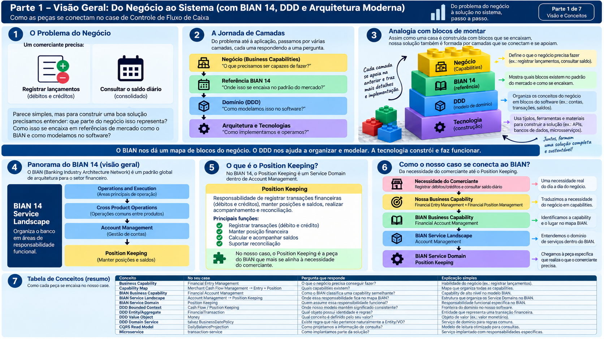

### 2. DDD estratégico e tático
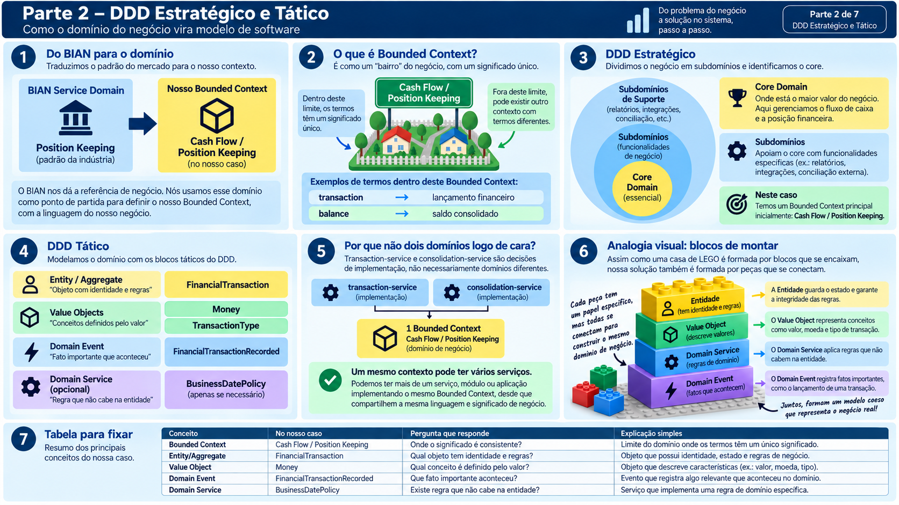

### 3. Arquitetura Hexagonal e microserviços
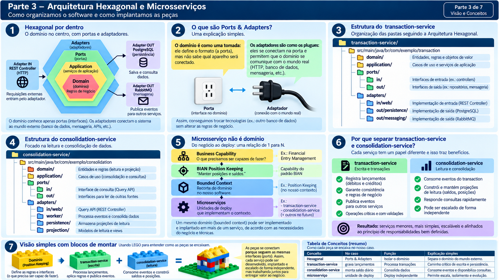

### 4. CQRS, eventos e Transactional Outbox
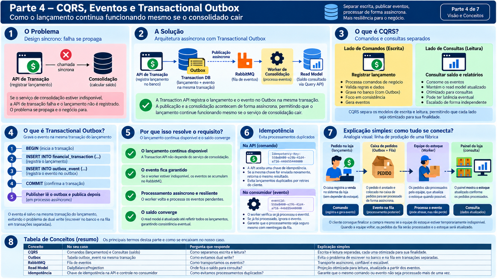

### 5. Banco de dados e projeções
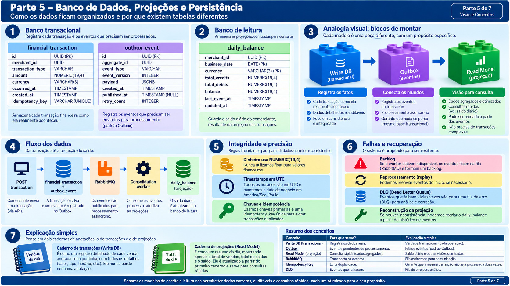

### 6. Contratos, APIs e padrões
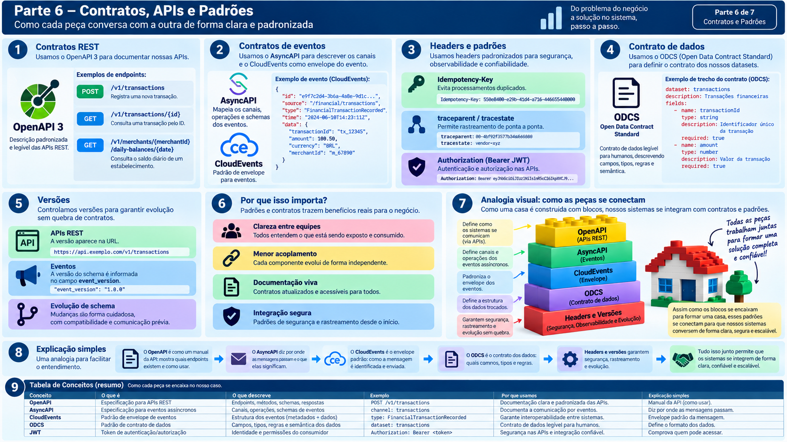

### 7. Segurança, observabilidade e testes
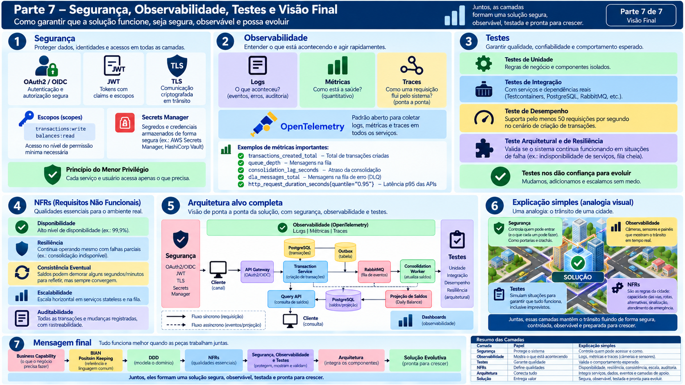

## Imagens complementares

### 8. Visão completa em 8 painéis
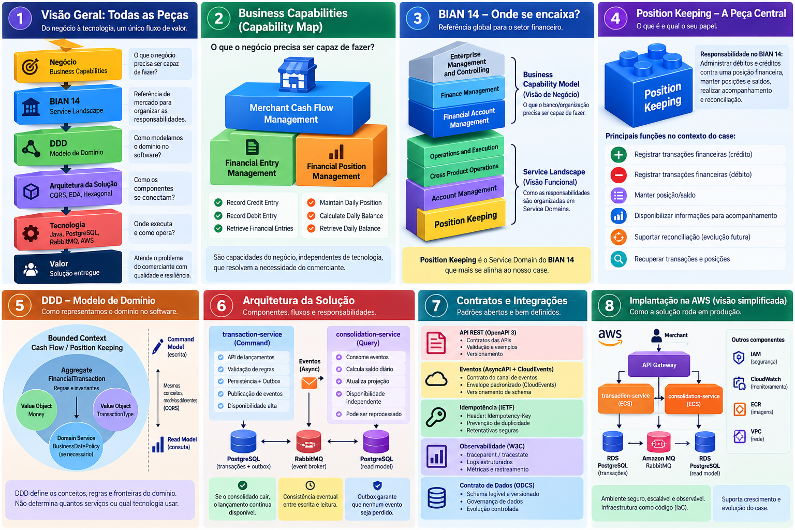

### 9. Case completo
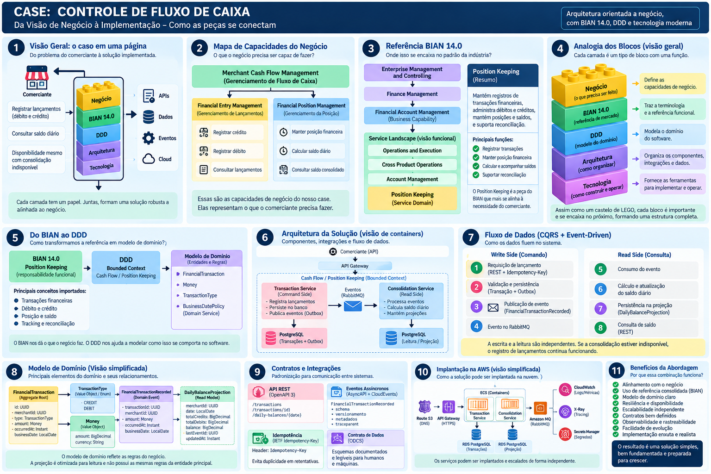

### 10. Arquitetura em camadas detalhada
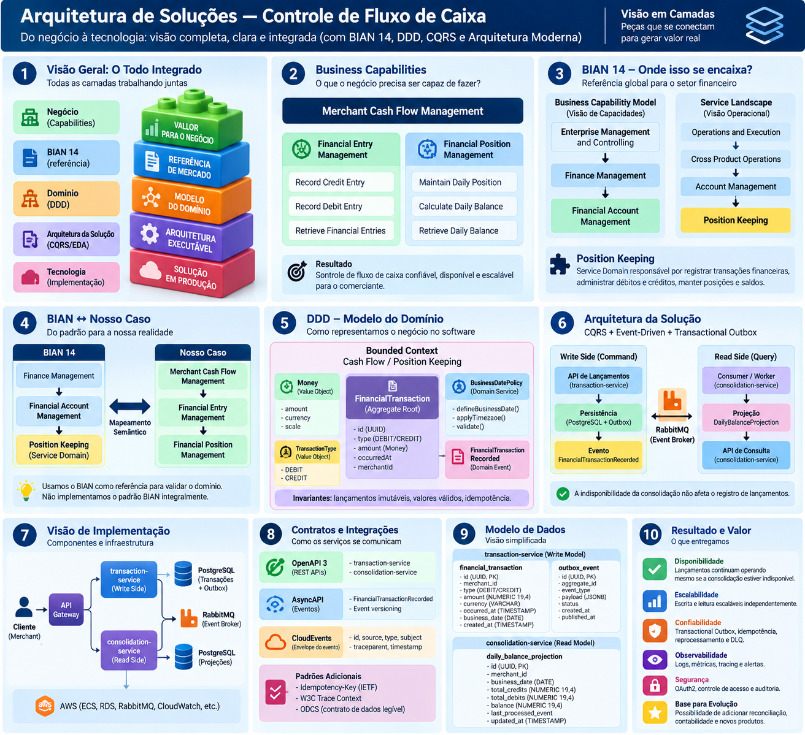

### 11. Mapa completo em 12 painéis
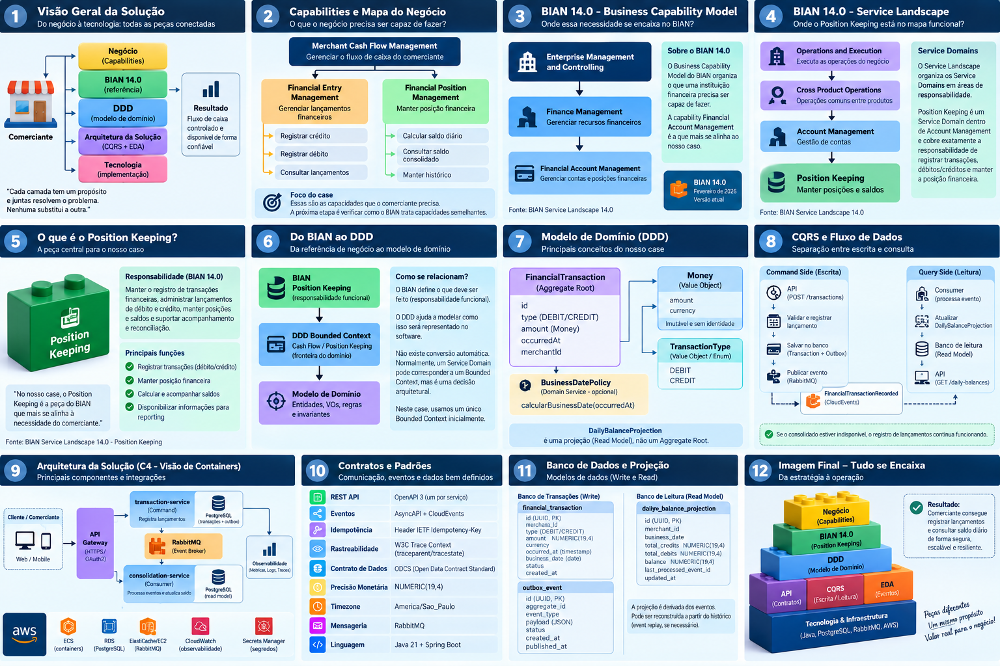

### 12. BIAN Model Map / Position Keeping didático
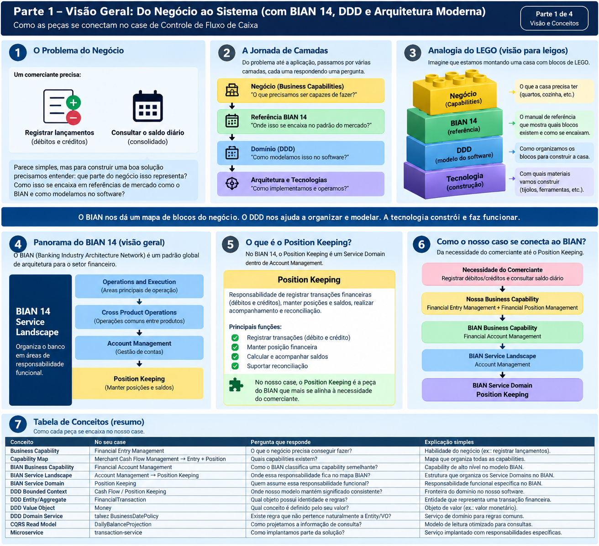
